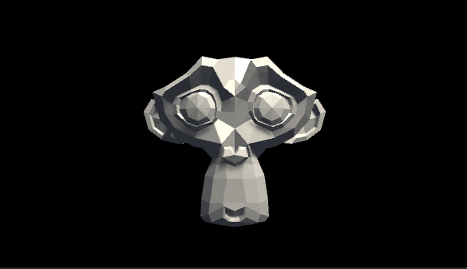
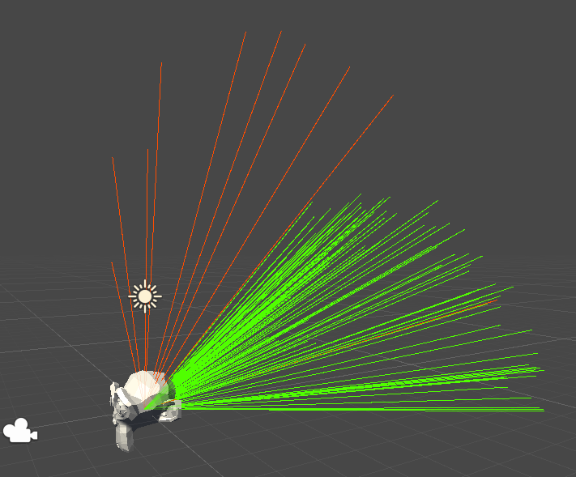
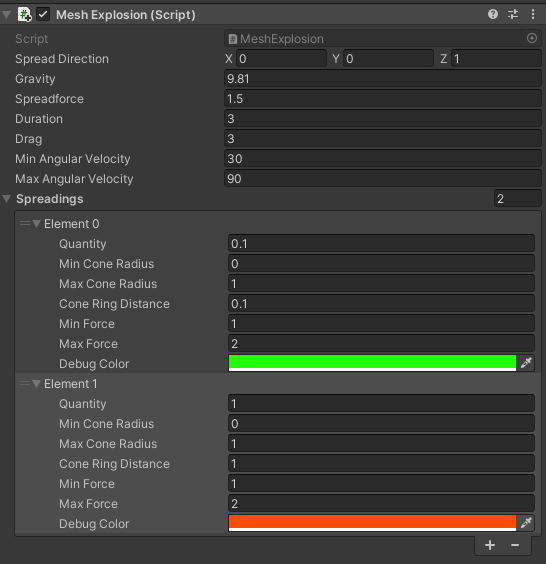

# Mesh Fragmentation

Fragment a mesh and simulate an explosion. 

# Usage
Put the `MeshExplosion` MonoBehaviour on a GameObject with a Mesh. Configure the explosion:
* `SpreadDirection`: The direction of the spread (in world space)
* `Gravity`: The gravity acceleration (down in world space)
* `SpreadForce`: The spread force (with a mass of 1). How fast fragments are spread
* `Duration`: The length of the animation in seconds
* `Drag`: How fast the fragments are slowed down
* `MinAngularVelocity`: Min value used to generate a random rotation of the fragments
* `MaxAngularVelocity`: Max value used to generate a random rotation of the fragments
* `Spreadings`: Set of spreading configuration. The spreading goes between two cones of radius `MinConeRadius` and `MaxConeRadius`. Both cones use the main `SpreadDirection`
    * `Quantity`: [0..1] percentage of fragments using this spreading configuration 
    * `MinConeRadius`: First cone radius
    * `MaxConeRadius`: Second cone radius
    * `ConeRingDistance`: The length of the cone. Low value sets a wide spreading. High value sets a narrow spreading.
    * `MinForce`: Min value used to generate a random scale applied to the `SpreadForce`
    * `MaxForace`: Max value used to generate a random scale applied to the `SpreadForce`
    * `DebugColor`: Color used in the scene view

# Quick overview

The `MeshFragmenting` class splits the mesh into fragments (it make sure each triangle has its own vertices).

The `MeshExplosion` class animates the fragments over time.